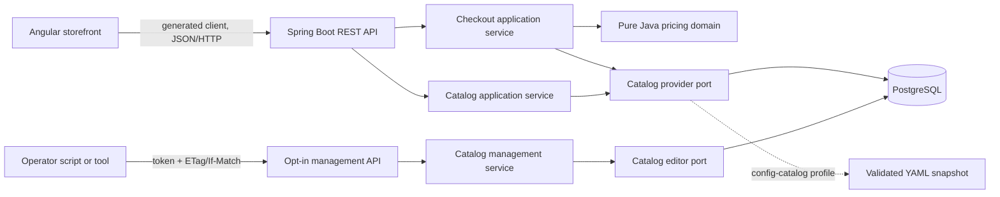

# Architecture

## System context

The solution is a modular monolith with a separately built browser application. The backend is the authority for catalog data and every monetary calculation.



The storefront never calculates prices. It sends product IDs and integer quantities, then renders the itemized receipt returned by checkout. This keeps offer rules in one place and avoids disagreement between clients.

## Backend boundaries

Backend packages are grouped by feature and then by role:

```text
com.example.supermarket
├── catalog
│   ├── api                 generated-interface controllers and REST mapping
│   ├── application         catalog reads, replacement orchestration and ports
│   ├── configuration       YAML fallback binding and provider wiring
│   ├── domain              product, offer, exact-money and snapshot invariants
│   └── persistence         PostgreSQL provider and atomic editor
├── checkout
│   ├── api                 generated-interface controller and REST mapping
│   ├── application         checkout coordination
│   ├── configuration       service wiring
│   └── domain              cart, pricing and receipt behavior
└── support.api             shared HTTP error and JSON configuration
```

The dependency direction is API/configuration/persistence to application to domain. The checkout feature may read catalog data through `CatalogProvider`; catalog code cannot depend on checkout. ArchUnit tests enforce the important package rules. Domain types import neither Spring nor generated OpenAPI classes.

MapStruct converts structural data at the REST boundary. Catalog lookup, validation, quantity aggregation and offer calculation stay in application/domain code.

## Contract and generation

`api/openapi.yaml` is the REST source of truth. The pinned OpenAPI Generator creates Spring interfaces and models under the backend build directory and the committed Angular client under `frontend/src/app/generated/api`. Generated files are never edited by hand.

The contract check regenerates the complete Angular client in a temporary build directory and compares file names and bytes. Backend compilation regenerates its Spring side. A contract change therefore reaches both consumers through compile-time types, while the drift check catches a forgotten frontend regeneration.

## Checkout request flow

1. The browser loads the current products and opaque `catalogRevision`.
2. It keeps only product IDs and quantities in page-scoped cart state.
3. `POST /api/checkout` maps the request into a domain command.
4. `CheckoutService` combines requested IDs into one catalog lookup and rejects missing products.
5. `PricingCalculator` aggregates duplicate lines, applies every complete quantity-offer bundle, prices the remainder normally, and creates an immutable receipt.
6. The REST mapper serializes exact two-decimal EUR strings and returns the revision of the snapshot used for pricing.
7. The browser displays the receipt only when that revision still matches its displayed catalog.

Receipts are quotes. They are not stored, and the revision does not reserve a price after the response.

## Catalog storage and live updates

PostgreSQL is the default catalog. Flyway owns the schema and inserts demo data once; an intentionally empty catalog remains empty after restart. Products, offers and the catalog revision are read in one SQL statement so a request cannot mix committed catalog versions.

The optional `catalog-management` profile exposes whole-catalog GET/PUT operations on loopback by default. A shared operator token protects the endpoints. GET returns the revision as a strong ETag; PUT requires it in `If-Match`, updates the revision conditionally, and replaces products/offers in the same transaction. A missing precondition receives `428` and a stale writer receives `412`; validation or database failures leave the earlier catalog intact.

The `config-catalog` profile replaces PostgreSQL with a validated immutable YAML snapshot. It is useful for a lightweight demonstration, but changes to that file require restart and cannot use the management API.

## Frontend structure

```text
frontend/src/app
├── features/checkout
│   ├── components
│   │   ├── product-list
│   │   ├── cart
│   │   └── receipt
│   ├── pages/checkout-page
│   └── state/cart-state.ts
└── generated/api
```

The page coordinates requests, catalog revisions and transient status. Components render focused pieces of the checkout experience. Signal-based cart state derives counts and the checkout request without storing money. The generated service owns HTTP paths and payload types.

## Verification boundaries

`./scripts/verify.sh all` runs backend formatting, contract generation/validation, unit and property tests, HTTP tests, PostgreSQL Testcontainers tests, architecture checks, coverage gates, frontend lockfile installation, formatting, linting, component/service tests, coverage and the production build. CI calls the same entry points in separate backend, contract and frontend jobs.

The deliberately excluded capabilities are documented in [scope and assumptions](assumptions.md). Detailed API behavior is in [the contract guide](api.md), and the operator workflow is in [catalog management](catalog-management.md).
